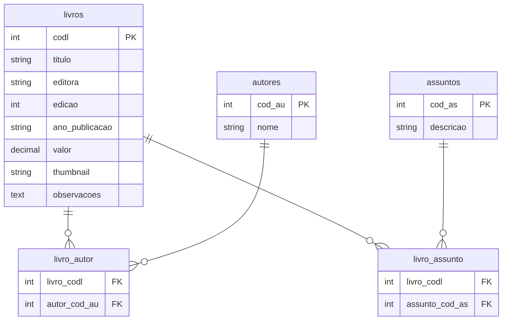

# Books Service — Backend

API REST construída em **Laravel 11** com **PHP 8.4** para gerenciamento de um acervo de livros.

---

## Como rodar

### Pré-requisitos

- [Docker](https://www.docker.com/) instalado e rodando

É só isso. PHP, Composer e banco de dados rodam dentro do container.

---

### 1. Subir a API

```bash
docker compose up app -d
```

A API estará disponível em **http://localhost:8000/api**

---

### 2. Rodar as migrations

Na primeira vez (ou se precisar recriar o banco):

```bash
docker compose exec app php artisan migrate --force
```

Isso cria todas as tabelas e a view do relatório automaticamente.

---

### 3. Popular com massa inicial (recomendado)

```bash
docker compose exec app php artisan db:seed --force
```

Isso popula o banco com autores, assuntos e livros via `BibliotecaSeeder`.

---

### 4. Validar se a API está respondendo

```bash
curl -i http://localhost:8000/api/livros
```

Esperado: status **200 OK**.

---

### 5. Subir o Swagger (opcional)

Para explorar e testar os endpoints pelo navegador:

```bash
docker compose up swagger -d
```

Acesse **http://localhost:8080**

---

### 6. Rodar os testes

```bash
docker compose exec app php artisan test
```

Os testes usam SQLite em memória, então rodam rápido e sem tocar no banco de desenvolvimento.

### 7. Verificar cobertura de testes

```bash
docker compose exec app php artisan test --coverage
```

Cobertura total atual: **51.2%**.

---

### Parar tudo

```bash
docker compose down
```

---

## Modelo de dados



Um livro pode ter múltiplos autores e múltiplos assuntos.

---

## Endpoints

| Método | Rota | Descrição |
|---|---|---|
| GET | `/api/livros` | Lista paginada (aceita `per_page` e `page`) |
| GET | `/api/livros?all=1` | Lista completa sem paginação |
| POST | `/api/livros` | Cria livro |
| GET | `/api/livros/{id}` | Detalhe com autores e assuntos |
| PUT | `/api/livros/{id}` | Atualiza livro |
| DELETE | `/api/livros/{id}` | Remove livro |
| GET | `/api/autores` | Lista todos os autores |
| POST | `/api/autores` | Cria autor |
| GET | `/api/autores/{id}` | Busca um autor |
| PUT | `/api/autores/{id}` | Atualiza autor |
| DELETE | `/api/autores/{id}` | Remove autor |
| GET | `/api/assuntos` | Lista todos os assuntos |
| POST | `/api/assuntos` | Cria assunto |
| GET | `/api/assuntos/{id}` | Busca um assunto |
| PUT | `/api/assuntos/{id}` | Atualiza assunto |
| DELETE | `/api/assuntos/{id}` | Remove assunto |
| GET | `/api/relatorios/livros-por-autor` | Relatório da view agrupado por autor |

---

## O que foi construído e por quê

### Defesa da arquitetura utilizada

A arquitetura adotada prioriza **simplicidade operacional**, **consistência de dados** e **facilidade de avaliação técnica**:

- **Laravel 11 + API REST**: entrega rápida e organizada com conventions maduras, validação robusta, Eloquent para relacionamento N:N e boa testabilidade.
- **SQLite em arquivo único**: reduz dependências para execução local e prova técnica; evita acoplamento a um serviço externo de banco sem perder integridade relacional.
- **Docker Compose com serviços mínimos (`app` e `swagger`)**: baixa fricção para subir ambiente e documentação com um único comando.
- **Migrations versionadas (incluindo view)**: infraestrutura de banco reproduzível, auditável e consistente entre máquinas.
- **Seeders determinísticos**: massa inicial pronta para demonstração funcional e validação dos endpoints sem setup manual.
- **Controllers orientados a recurso**: endpoints claros por agregado (`livros`, `autores`, `assuntos`) e tratamento de erro alinhado a contratos HTTP (404/422/409).

Essa escolha é intencional para o contexto da prova: maximizar previsibilidade de execução e clareza de manutenção, com custo de operação mínimo.

### Banco de dados

Optei por **SQLite** — o banco fica em um arquivo único (`database/database.sqlite`), sem precisar subir um serviço separado de banco no Docker. Para o porte desta aplicação é mais do que suficiente, e elimina uma camada de complexidade na hora de rodar.

O modelo de dados foi seguido fielmente. Os campos extras adicionados em `livros` (`valor`, `thumbnail`, `observacoes`) são extensões naturais do cadastro que não quebram nenhuma constraint do modelo original.

### Relatório via view

A view `vw_relatorio_livros_por_autor` foi criada por migration — assim ela faz parte do versionamento do projeto e é recriada automaticamente em qualquer ambiente. O endpoint do relatório lê direto da view e devolve o JSON já agrupado por autor, tratando corretamente livros com múltiplos autores.

### Tratamento de erros

Cada situação tem seu tratamento específico: 404 quando o recurso não existe, 422 com detalhamento dos campos inválidos, 409 quando há violação de integridade referencial (tentar deletar um autor que tem livros, por exemplo). Os `QueryException` são interceptados e o código do erro banco é verificado antes de qualquer resposta genérica.

### Testes

44 testes de feature cobrindo todos os endpoints. Os testes foram escritos depois da implementação, mas guiados pelo comportamento esperado de cada endpoint — validações, status codes, efeitos colaterais no banco (cascade, sync de pivot).

Durante os testes foi encontrado e corrigido um bug real: os métodos `destroy` dos três controllers tinham `JsonResponse` como tipo de retorno, mas `response()->noContent()` retorna `Response`. O PHP 8.4 levantou o erro em runtime.

---

## Estrutura de pastas

```
books-service/
├── app/
│   ├── Http/Controllers/Api/   # LivroController, AutorController, AssuntoController, RelatorioController
│   └── Models/                 # Livro, Autor, Assunto
├── database/
│   ├── migrations/             # Tabelas + view do relatório
│   └── seeders/                # DatabaseSeeder + BibliotecaSeeder
├── openapi/
│   └── openapi.yaml            # Documentação OpenAPI 3 (visualizada no Swagger)
├── tests/
│   └── Feature/                # LivroTest, AutorTest, AssuntoTest, RelatorioTest
└── docker-compose.yml
```
